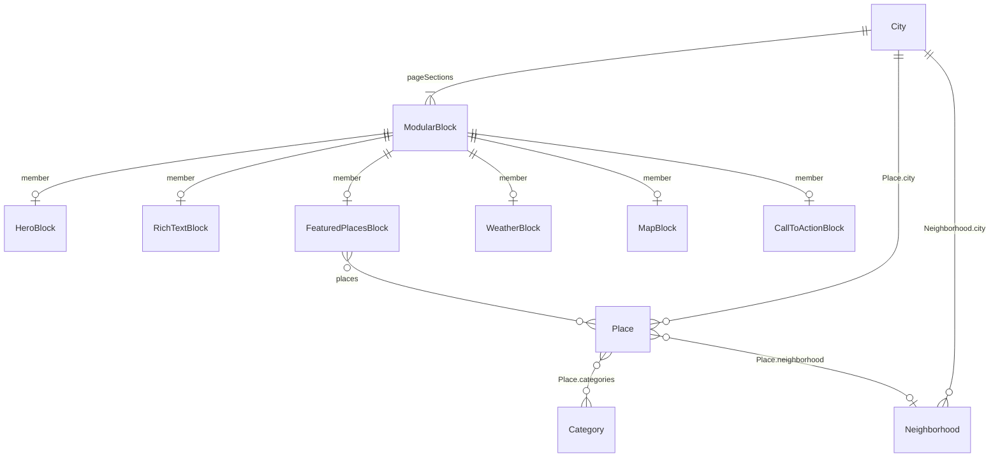

# Relationship diagram — A1

**Role:** Schema planner  
**Source:** `PRD.md` §9, plus `City.pageSections` Modular Content from §8.1 / §8.5  
**Authority:** `AGENTS.md` > `PRD.md` > `PLAN.md`

Matches PRD §9. No extra models. Weather is a Remote Field on City, not a related content model.

## Cardinality (PRD §9)

```
text
City 1 ──── many Place
City 1 ──── many Neighborhood
Place many ──── many Category
Place many ──── 1 Neighborhood
City.pageSections ──── FeaturedPlacesBlock ──── many Place
```

## Mermaid



`ModularBlock` is not a Hygraph model. It stands for the Modular Content union on `City.pageSections`.

## Modular Content (not a model)

`pageSections` is required Modular Content on City. It is **not** localized as a unit. Localized copy lives on fields inside each block (FR-06 / PRD §8.5).

```
text
City
 ├── location (Map) ──────────────── weather Path inputs + map center
 ├── timezone ────────────────────── weather Path input
 ├── heroImage (required Asset)
 ├── seo (optional SEO component)
 ├── Remote Field weather | openMeteo (proposed name; not content)
 └── pageSections (Modular Content)
      ├── HeroBlock          (optional extra hero; not a second required hero)
      ├── RichTextBlock
      ├── FeaturedPlacesBlock
      │    └── places ────── many Place
      ├── WeatherBlock       (placement only; values from Remote Field)
      ├── MapBlock           (markers from Place.location)
      └── CallToActionBlock
```

`FeaturedPlacesBlock.places` empty → frontend uses published Place records with `isFeatured` true. That fallback is a query rule, not another relation.

## Weather (not a relation)

```
text
City ──REST Remote Field──► Open-Meteo (live)
```

No Weather model. No weather entries. See `docs/weather-remote-contract.md`.

## Out of diagram

- **D-A0-1** scheduled publishing: A3 / plan conflict, not a relation or field
- Reverse relation `apiId` names Hygraph may create: UNVERIFIED until A2
- Neighborhood `location`: optional Map on Neighborhood; not used as a required edge for map or weather

## UNVERIFIED

- Exact Modular Content union type name in GraphQL (`pageSections` field is specified; union `apiId` is not)
- Reverse fields such as `City.places` / `Category.places` (convenient if present; not PRD fields)
- Remote Field GraphQL name (`weather` vs `openMeteo`)
